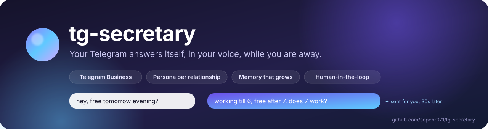

<p align="center">
  
</p>

<p align="center">
  <a href="https://www.python.org/downloads/"></a>
  <a href="LICENSE"></a>
  
  
</p>

# tg-secretary

**A personal Telegram autoresponder that replies to your private chats as you.** It connects to your own account through Telegram Business chatbots, waits to see whether you answer yourself, and if you don't, writes a reply in your voice. Each contact gets a persona that matches your relationship, a memory that grows with every conversation, and a safety gate that holds the sensitive messages for your approval.

Built for one person's account, with Persian and English in mind. It is not a customer-support bot and it never messages anyone first.

> **In one line for agents and skimmers:** Python 3.13 bot (`python-telegram-bot`) + SQLite + an LLM (Claude Haiku 5.5 via the Anthropic API, or any model via OpenRouter). Single owner, per-contact personas and memory, human-in-the-loop drafts, local web dashboard, optional multi-user hosting platform in `hosting/`. Developer notes live in [CLAUDE.md](CLAUDE.md).

## Table of contents

- [Why it exists](#why-it-exists)
- [What it does](#what-it-does)
- [How a reply happens](#how-a-reply-happens)
- [Quick start](#quick-start)
- [Choose a model provider](#choose-a-model-provider)
- [Dashboard](#dashboard)
- [Teach it your voice](#teach-it-your-voice)
- [Owner commands](#owner-commands)
- [Hosted platform](#hosted-platform)
- [Project map](#project-map)
- [Testing](#testing)
- [Deploy](#deploy)
- [Privacy and Telegram rules](#privacy-and-telegram-rules)
- [Security](#security)
- [For AI agents working on this repo](#for-ai-agents-working-on-this-repo)
- [License](#license)

## Why it exists

You are in a meeting, asleep, or just away from the phone. Friends keep writing. A generic "I'm busy" auto-reply feels cold, and a chatbot persona feels fake. tg-secretary answers the way you would: short, in your register, aware of who is writing and what you last talked about. When the message is the kind you should answer yourself, it drafts instead of sending and waits for your tap.

## What it does

| Area | Behaviour |
|---|---|
| **Speaks as you** | Replies go out through Telegram Business Mode. Contacts see your name and avatar, never a bot. |
| **Backs off when you are around** | A reply delay you can answer inside, a cooldown after you type in a chat, quiet hours, global and per-chat pause. |
| **One persona per relationship** | `gf`, `bff`, `close_friend`, `friend`, `family`, `work`, `acquaintance`, `unknown`. Stacked with an "about me" file, a per-contact prompt file and a database note. |
| **Memory that grows** | A background worker extracts facts, preferences, events, promises and inside jokes, keeps a rolling summary per chat, and fingerprints how you write to each person. |
| **Human-in-the-loop** | Approval mode drafts everything. The inner-circle gate drafts emotional, long or after-a-silence messages from partner, family and close friends. Drafts land in your bot DM with Send / Edit / Skip. |
| **Sounds human** | Colloquial Persian spelling, language mirroring, and cleanup of machine tells such as trailing periods, markdown and translation glosses. |
| **Private by default** | Raw message text is kept 7 days (configurable down to 1), then folded into a summary and deleted. One click deletes a chat or everything. |
| **Voice notes** | Transcribed with Whisper on OpenRouter and answered like text. On the Claude provider voice is passed to you instead ("coming soon" in the UI). |
| **Web dashboard** | Settings, contacts, memory, persona editor and the approval queue, served by the bot itself on localhost. |
| **Tested with real models** | An LLM-judged prompt suite and a local web tester for A/B/C model comparison. |

## How a reply happens

For every incoming text message:

1. Messages you typed yourself are stored and never answered.
2. Global pause, per-chat pause and quiet hours are checked.
3. If you typed in this chat recently (owner-active cooldown, default 600 s), the bot stays silent.
4. It waits for the reply delay: 30 s by default, 5 s in "away mode" (the bot replied last and you did not step in).
5. It checks again whether you typed during the wait and aborts if you did.
6. Inner-circle gate: for `gf`, `bff`, `family` and `close_friend`, an emotional keyword, a message over 200 characters, or more than 24 h of silence turns the reply into a draft for you.
7. Approval mode, if on, turns every reply into a draft.
8. Otherwise it assembles the system prompt (default persona, about-me, relationship persona, contact file, DB note, memory block, style fingerprint), calls the model, checks one last time that you have not typed, sends the reply, and queues memory extraction.

Voice notes are transcribed first and then take the same path. Voice notes over 120 s, or any voice note while transcription is off, notify you instead.

## Quick start

You need Python 3.13, [uv](https://docs.astral.sh/uv/), a Telegram account (Business chatbots work without Premium since Bot API 10.0), a bot token from [@BotFather](https://t.me/BotFather), and either an Anthropic API key or an [OpenRouter](https://openrouter.ai/keys) key.

1. **Create the bot.** In @BotFather run `/newbot` and save the token. Then `/mybots` → your bot → **Bot Settings → Business Mode** → enable.
2. **Install and run the wizard.**
   ```bash
   git clone https://github.com/sepehr071/tg-secretary.git
   cd tg-secretary
   uv sync
   uv run python -m secretary.setup
   ```
   The wizard checks the bot token (and that Business Mode is on) and the API key, proves you own the bot with a one-time `/start` link, and writes `.env`. Re-running it is safe: Enter keeps each current value and the old `.env` is backed up. On Ubuntu, `./scripts/setup-ubuntu.sh` installs everything and runs the wizard for you.
3. **Start it.** `pm2 start ecosystem.config.cjs`, or `uv run python -m secretary` without pm2.
4. **Connect your account.** In Telegram open **Settings → Business → Chatbots**, enter your bot's username, grant **reply to messages** and **read messages**, and choose which chats it may access.
5. **Say hello.** DM `/help` to your bot for the owner commands. It tells you when the business connection is added or removed and warns about missing rights.

New chats start untagged and use the `unknown` persona. Tag people with `/who` (`/senders` lists recent chat ids) or in the dashboard.

## Choose a model provider

| | Claude (Anthropic API) | OpenRouter |
|---|---|---|
| Turn on | `ANTHROPIC_API_KEY=` in `.env` | `OPENROUTER_API_KEY=` (used when no Anthropic key is set) |
| Reply model | `ANTHROPIC_MODEL`, default `claude-haiku-5-5` | `OPENROUTER_MODEL`, default `google/gemini-3.8-flash` |
| Memory / summaries | same model | `EXTRACTOR_MODEL`, default `google/gemini-3.1-flash-lite` |
| Voice notes | passed to you, no transcription | `WHISPER_MODEL`, default `openai/whisper-large-v3` |
| Cost tracking | every call recorded in the `llm_usage` table; `CREDIT_LIMIT_USD` stops replies at a cap | handled by the OpenRouter key limit |
| Sampling | none (Haiku 5.5 rejects temperature); adaptive thinking at low effort | temperature 0.6 plus frequency/presence penalties |

Switching is a one-line `.env` change and a restart.

## Dashboard

The bot serves a web dashboard on `127.0.0.1:8780` (`DASHBOARD_PORT` to change, `DASHBOARD_ENABLED=false` to turn off). Send `/dashboard` to the bot for a one-time login link. On a server, tunnel first: `ssh -L 8780:127.0.0.1:8780 user@server`.

It covers live settings, connection status, contacts (relationship, notes, prompt files, memory), persona prompts, privacy controls (retention, delete one chat, delete everything) and the approval queue.

To skip the tunnel, set `DASHBOARD_HOST=0.0.0.0` and `DASHBOARD_PUBLIC_URL=http://<server-ip>:8780` and open the port. Over plain http the login link and session cookie travel unencrypted and anyone on the path could send messages as you. Put an https reverse proxy (Caddy, nginx) in front and set `DASHBOARD_PUBLIC_URL=https://...`; the cookie is then marked Secure.

## Teach it your voice

Prompts live in `prompts/`. Real prompt files hold personal data and are gitignored; the repo ships `*.example.txt` templates.

- **Relationship personas:** copy `prompts/personas/<rel>.example.txt` to `prompts/personas/<rel>.txt` and edit. Missing `<rel>.txt` falls back to the example. `{owner_first_name}` is replaced with `OWNER_FIRST_NAME`.
- **About you:** copy `prompts/about_me.example.txt` to `prompts/about_me.txt`. Injected into every prompt as `## About me`.
- **Per contact:** create `prompts/contacts/<chat_id>.txt` (see `prompts/contacts/template-gf.txt.example`).
- **From Telegram:** `/prompt <chat_id> <fact>` appends a line to that contact's file; `/note <chat_id> <text>` stores a database note.
- After editing files by hand, send `/reload_prompts`.

Write example lines as an illustrative range ("examples of the register, vary your own phrasing"), not as closed lists or "they say X, you say Y" tables. Models treat closed lists as lookup tables and the replies come out repetitive.

## Owner commands

Send these to the bot in a direct message. Only `OWNER_USER_ID` can use them.

| Command | What it does |
|---|---|
| `/help` | Show the command list |
| `/pause`, `/resume` | Global mute toggle |
| `/status` | Current settings and counts |
| `/stats` | Reply counts (today / week) |
| `/last [N]` | Last N bot replies |
| `/undo <chat_id>` | Delete the bot's last auto-reply in that chat |
| `/pause_chat <chat_id>`, `/resume_chat <chat_id>` | Mute or unmute one chat |
| `/who <chat_id> [relationship] [nickname]` | Tag a contact (no relationship opens an inline picker) |
| `/note <chat_id> <text>` | Append a database-backed persona note |
| `/forget_chat <chat_id>` | Delete everything stored about a chat (contact row stays) |
| `/persona_for <chat_id>` | Show the fully assembled system prompt |
| `/persona_path <chat_id>` | Path to the contact's `.txt` file |
| `/prompt <chat_id> [fact]` | Append a fact, or with no fact list facts with delete buttons |
| `/reload_prompts` | Re-read prompt files |
| `/memory <chat_id>` | List memory rows |
| `/remember <chat_id> <kind> <text>` | Add a memory row manually |
| `/forget <memory_id>` | Soft-delete a memory row |
| `/extract <chat_id>` | Run memory extraction now |
| `/style <chat_id>` | Show the style fingerprint |
| `/memory_cleanup <chat_id>\|all` | Deduplicate memory rows |
| `/memory_purge <chat_id>\|all` | Wipe memory and rebuild from scratch |
| `/approval on\|off` | Every reply becomes a draft for approval |
| `/innercircle on\|off` | Safety gate for partner / family / close friends |
| `/voice on\|off` | Voice transcription toggle (OpenRouter provider only) |
| `/quiet HH:MM HH:MM\|off` | Quiet hours |
| `/delay [seconds]` | Auto-reply delay (default 30) |
| `/away_delay [seconds]` | Delay in away mode (default 5) |
| `/cooldown [seconds]` | Owner-active mute window (default 600) |
| `/retention [days\|off]` | Days raw message text is kept (default 7, `off` = forever) |
| `/preview <text>` | Dry-run a draft without sending |
| `/contacts` | List tagged chats |
| `/senders [N]` | Last N chats that messaged you, including untagged |
| `/find <query>` | Search nicknames and connections |
| `/say <chat_id> <text>` | Send a message as you, manually |
| `/pending` | List outstanding drafts |
| `/approve_<id>`, `/edit_<id> <text>`, `/skip_<id>` | Act on a draft (same as the Send / Edit / Skip buttons) |
| `/backup` | Consistent SQLite snapshot to a timestamped file |

## Hosted platform

`hosting/` is a multi-user control plane: a Persian website where people sign in with Telegram, accept the terms, describe themselves, pay, and connect one shared platform bot. Each user gets their own secretary process (pm2 `tgs-<id>`, own `.env`, database and prompts) and reaches their dashboard under `/app`. The platform meters Claude spend per user and stops the secretary at the paid cap. See [hosting/README.md](hosting/README.md).

## Project map

```
secretary/            the bot (single owner)
├── __main__.py       entrypoint: handlers, memory worker, dashboard server
├── config.py         pydantic-settings; ANTHROPIC_API_KEY picks the provider
├── handlers.py       inbound routing, race guards, delays, HITL fork, credit guard
├── llm.py            reply generation and output cleanup (both providers)
├── claude.py         Anthropic calls with per-call usage accounting
├── memory.py         extraction worker, style fingerprint, summary rollups, retention sweep
├── prompts.py        persona stack assembly (defaults → about_me → persona → contact → note → memory → style)
├── innercircle.py    emotional keyword / length / silence gate
├── voice.py          Whisper transcription (OpenRouter)
├── db.py             one aiosqlite connection, WAL, all queries
├── commands.py       owner-only / commands
├── setup.py          first-run wizard
└── dashboard/        FastAPI web UI (status, settings, contacts, prompts, drafts), Persian strings in fa.py
hosting/              multi-user platform (site, shared bot router, tenants, payments, proxy)
prompts/              persona templates, about_me, per-contact files (real files gitignored)
scripts/              smoke tests, prompt suite, fixture dumper, Ubuntu setup
tests/                scenarios, rubrics, judge prompt, snapshots
webtest/              local replay tester comparing up to three models
```

Storage is one SQLite file per secretary: `connections`, `messages`, `chat_summaries`, `contact_overrides`, `contact_memory`, `extraction_queue`, `pending_replies`, `bot_state`, `llm_usage`.

## Testing

There is no pytest suite. Offline smoke checks cover the pipeline, dashboard and hosting logic; prompts are tested with real model calls graded by an LLM judge.

```bash
uv run python scripts/smoke_core.py                              # pipeline logic, retention, Claude accounting (offline)
PYTHONIOENCODING=utf-8 uv run python scripts/smoke_dashboard.py  # dashboard routes and DB helpers (offline)
PYTHONIOENCODING=utf-8 uv run python scripts/smoke_hosting.py    # hosting platform (offline)
uv run python scripts/test_prompts.py --no-judge                 # prompt assembly + real reply + structural checks
uv run python scripts/test_prompts.py                            # adds judge grading per relationship rubric
```

Scenarios live in `tests/fixtures/scenarios/`, rubrics in `tests/fixtures/rubrics/`, snapshots in `tests/snapshots/`. `scripts/dump_fixtures.py` turns your own `secretary.db` into scenarios, anonymized by default; `--no-anonymize` writes gitignored `raw_*.json` files that still go to the model API when you run the suite.

Web tester for replaying a real chat against up to three models side by side:

```bash
PYTHONIOENCODING=utf-8 uv run python -m webtest   # http://127.0.0.1:8765/
```

## Deploy

Ubuntu with pm2:

```bash
./scripts/setup-ubuntu.sh                 # interactive, re-runnable: uv, Python 3.13, Node, pm2, .env, start
pm2 start ecosystem.config.cjs            # day-to-day start
pm2 logs tg-secretary
pm2 startup systemd -u $USER --hp $HOME   # run the printed sudo line, then:
pm2 save
```

## Privacy and Telegram rules

Read this before connecting the bot to real chats.

- **Contact messages go to a model provider.** Message text, chat history, memory and transcribed voice notes are sent to Anthropic or to OpenRouter and the providers behind it. The [Telegram Bot Developer Terms](https://telegram.org/tos/bot-developers) (§5.4(iv)) require the user's authorization before business message contents are shared with third-party APIs. Make sure you have it, and pick providers whose data policies you accept.
- **Raw messages are short-lived.** Text is kept `MESSAGE_RETENTION_DAYS` (default 7; `/retention` or the dashboard changes it live). Hourly, older rows are folded into the per-chat summary and deleted; memory facts, summaries and contact rows stay. `0` keeps everything. The dashboard deletes one chat or every chat on demand.
- **The database is plaintext.** `secretary.db` is unencrypted. The Bot Developer Terms (§4.4(a)) ask for encryption at rest, so run on an encrypted disk (LUKS, BitLocker, FileVault) and restrict host access.
- **Whoever runs the host can read the data.** No at-rest encryption changes that for an autoresponder: the process needs plaintext to reply while you are away. If you don't want a hosted operator in that position, run it yourself.
- **No spam.** Only answer people who write to you. Never bulk or unsolicited messaging.
- **It speaks as you.** You are responsible for everything it sends. Use approval mode or the inner-circle gate for the conversations that matter.
- **AI disclosure.** Some jurisdictions require telling people they are talking to an AI. Check the laws that apply to you and your contacts.

## Security

The bot only serves the Business connection of `OWNER_USER_ID`; anyone else who attaches it to their account is ignored. `.env` holds the bot token and the model API key; whoever has it can read and send as you in every connected chat. Never commit it or paste it anywhere. If it leaks, revoke the token with @BotFather (`/revoke`) and rotate the API key. Telegram file download URLs embed the bot token and can appear in HTTP debug logs, so treat logs as sensitive too.

## For AI agents working on this repo

- Start with [CLAUDE.md](CLAUDE.md): architecture, the reply pipeline, foot-guns and internal patterns, kept current with the code.
- Run the three smoke scripts above before claiming a change works; they need no network and no `.env`.
- Prompt text lives in `secretary/prompts.py` and `prompts/*.example.txt`. Never add closed vocabulary lists or output-capturing fields to the style fingerprint (feedback loop).
- `hosting/` is the package name; never `platform`. Tenant updates must keep both `X-Platform-Auth` and `X-Platform-Route` checks.
- Persian ZWNJ in code is written as an escape (`\u200c` in Python and JSON, `\u{200C}` in PHP), never as the invisible character.

## License

MIT. See [LICENSE](LICENSE).
